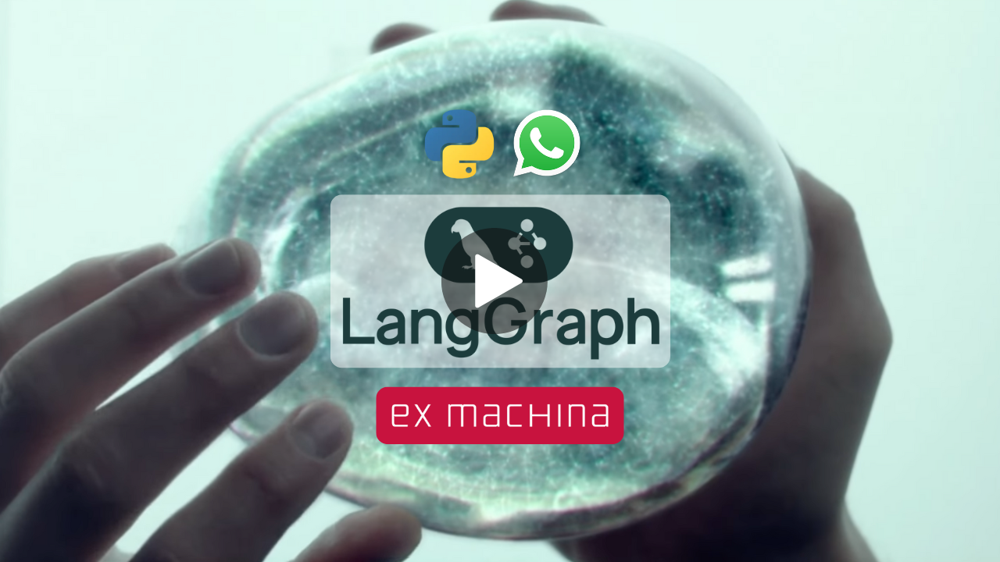

        
    <h1 align="center">📱 Ava 📱</h1>
    <h3 align="center">Turning the Turing Test into a WhatsApp Agent</h3>

    

## Table of Contents

- [Course Overview](#course-overview)
- [Who is this course for?](#who-is-this-course-for)
- [What you'll get out of this course](#what-youll-get-out-of-this-course)
- [Course syllabus](#course-syllabus)
- [Getting started](#getting-started)
- [The tech stack](#the-tech-stack)
- [Contributors](#contributors)
- [License](#license)

## Project  Overview

What happens when [two ML Engineers](#contributors) with a love for sci-fi movies team up? 🤔

You get **Ava**, a Whatsapp agent that can engage with users in a "realistic" way, inspired by the great film [Ex Machina](https://www.imdb.com/es-es/title/tt0470752/). Ok, you won't find a fully sentient robot here, but you **will** have some pretty interesting Whatsapp conversations.

By the end of this course, you'll have built your own Ava too, capable of:

* Receiving and sending Whatsapp messages 📲
* Understanding your voice 🗣️
* Recognizing your images 🖼️
* Sending voice notes back 🎤
* Sharing updates about its "daily activities" 🚣
* Sending you images of its current activities 🖼️

>You can think of it as a modern reinterpretation of the Turing Test 🤣

Excited? Let's get started! 

    <video src="https://github.com/user-attachments/assets/6d1abefc-b4d8-4f66-9db6-a0e54b8df944" controls width="100%"></video>

---

<table style="border-collapse: collapse; border: none;">
  <tr style="border: none;">
    <td width="20%" style="border: none;">
      
    </td>
    <td width="80%" style="border: none;">
      

        <h2>📬 Stay Updated</h2>
        
<b><a href="https://theneuralmaze.substack.com/">Join The Neural Maze</a></b> and learn to build AI Systems that actually work, from principles to production. Every Wednesday, directly to your inbox. Don't miss out!

      

    </td>
  </tr>
</table>

  

---

## What you'll do this app

* Build a fully working WhatsApp agent you can chat with on your phone
* Get a solid understanding of how to build LangGraph workflows
* Set up a long-term memory system using Qdrant as a Vector Database
* Use Groq models to power AI Agent responses
* Implement STT systems using Whisper
* Implement TTS systems using ElevenLabs
* Generate high-quality images using diffusion models, like FLUX models
* Process images using VLM models, like llama-3.2-vision
* Create chat interfaces using Chainlit
* Deploy agentic applications to Cloud Run
* Connect agentic applications to the WhatsApp API

## Getting started

Before you begin the course, there are a few things you need to do. 

I'm referring to the virtual environment creation, dependencies installation, `.env` file creation, etc. I know, it's very boring, but it's a necessary evil! 😅

All of this is detailed in the following doc: [GETTING STARTED.md](docs/GETTING_STARTED.md).

> Make sure you follow the instructions in the doc, as it's crucial for the course to work.

## Course syllabus

| Lesson Number | Written Lesson | Video Lesson | Description |
|---------------|----------------|--------------|-------------|
| 
1
 | [Project overview](https://theneuralmaze.substack.com/p/meet-ava-the-whatsapp-agent) |  | Understand the project architecture and the tech stack. |
| 
2
 | [Dissecting Ava's brain](https://theneuralmaze.substack.com/p/dissecting-avas-brain) |  | Learn the basics of LangGraph and implement complex workflows using this framework. |
| 
3
 | [Unlocking Ava's memories](https://theneuralmaze.substack.com/p/can-agents-get-nostalgic-about-the) |  | Build a short-term memory system for graph state persistence and chat history. Also, implement a long-term memory system using Qdrant. |
| 
4
 | [Giving Ava a Voice](https://theneuralmaze.substack.com/p/the-ultimate-ai-voice-pipeline) |  | Build a STT and a TTS pipeline to make Ava process input and output audio. |
| 
5
 | [Ava learns to see](https://theneuralmaze.substack.com/p/reading-images-drawing-dreams-vlms) |  | Understand how to process images using VLM models. Implement an image generation pipeline using FLUX models. |
| 
6
 | [Ava installs Whatsapp](https://theneuralmaze.substack.com/p/connecting-an-ai-agent-to-whatsapp) |  | Connect Ava to WhatsApp. Learn how to deploy a LangGraph application to Google Cloud Run. |

---

---

## The tech stack

<table>
  <tr>
    <th>Technology</th>
    <th>Description</th>
  </tr>
  <tr>
    <td></td>
    <td>Powering the project with Llama 3.3, Llama 3.2 Vision, and Whisper. Groq models are awesome (and fast!!)</td>
  </tr>
  <tr>
    <td></td>
    <td>Serving as the long-term database, enabling our agent to recall details you shared months ago.</td>
  </tr>
  <tr>
    <td></td>
    <td>Deploying your containers easily to Google Cloud Platform</td>
  </tr>
  <tr>
    <td></td>
    <td>Learn how to build production-ready LangGraph workflows</td>
  </tr>
  <tr>
    <td></td>
    <td>Amazing TTS models</td>
  </tr>
  <tr>
    <td></td>
    <td>Behind Ava's image generation process</td>
  </tr>
</table>

